# 1.-Introducción.
Nginx es un servidor web que también se puede utilizar como proxy inverso, equilibrador de carga, proxy de correo y caché HTTP.

# 2.-Comparativa con Apache.
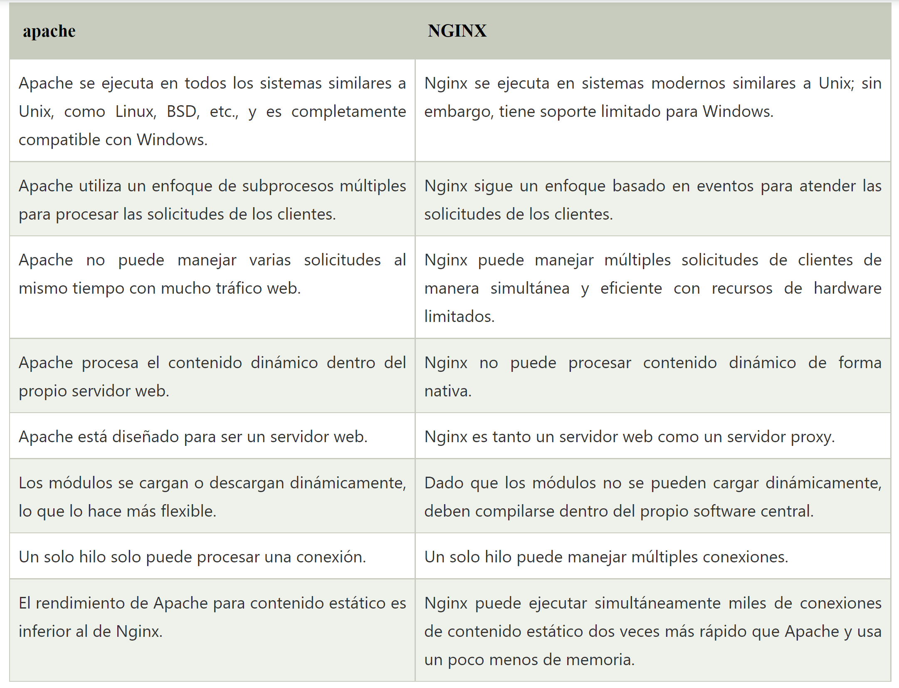

# 3.- Instalación.
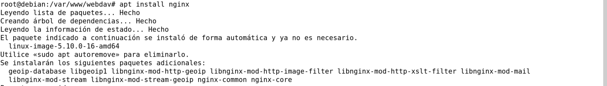

# 4.- Casos prácticos.
## a) Versión de Nginx instalado.
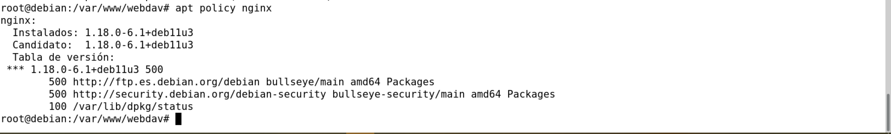

## b) Ficheros de configuración.
Los ficheros de configuración se encuentran en `/etc/nginx`
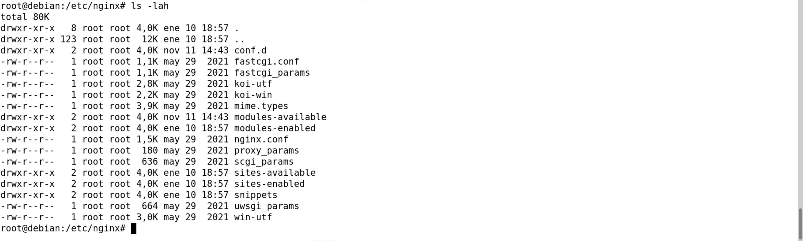

El fichero de configuración por defecto es `/etc/nginx/sites-enabled/default` 
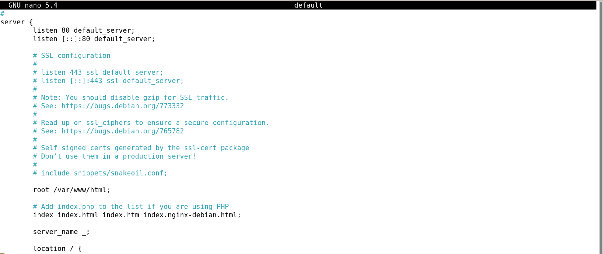


## c) Página web por defecto:
La página web por defecto se encuentra en `/var/www/html` 


Se puede acceder con el navegador.
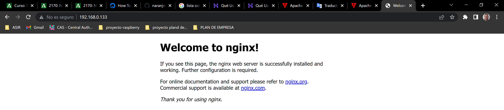

Creamos un index.html


## d) Virtual Hosting:
Queremos que nuestro servidor web ofrezca balanceo de carga desde https  a dos sitios web que tengan también https.

Primero, configuramos en dos maquinas virtuales la ip estática (.171, .172) y cambiamos la página web por defecto.


En una tercera máquina virtual (con ip .170) vamos a configurar el balanceador, que gestionará las peticiones y decidirá que servidor responde.

En la máquina balanceador, hacemos una copia del fichero de configuración por defecto y creamos otro dentro de `/etc/nginx/conf.d/` llamado load-balancing.conf.
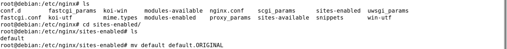
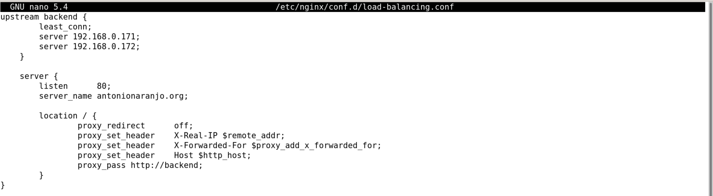

Comprobamos que la sintaxis es correcta mediante `nginx -t` y reiniciamos el servicio.

Creamos una máquina cliente, y modificamos su `/etc/hosts` añadiendo la ip del balanceador de cargo y su dominio.
 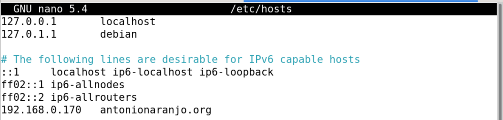

 Para finalizar, entramos al navegador y escribimos la dirección de enlace y vemos como el balanceador de carga se encarga de redistribuir las peticiones entre el servidor 1 y el 2.
 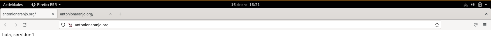
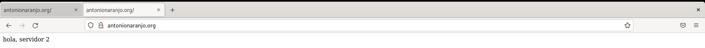

### Configurar https
Para configurar https hacen falta dos cosas:
1. Escuchar en el puerto 443.
2. Crear un certificado e indicar la ruta en la configuración de nginx.

El certificado se puede crear con el siguiente comando:

```
sudo openssl req -x509 -nodes -days 365 -newkey rsa:2048 -keyout /etc/ssl/private/antonio.key -out /etc/ssl/certs/antonio.crt
```

 

 Modificamos la configuración de nginx de la siguiente manera:

 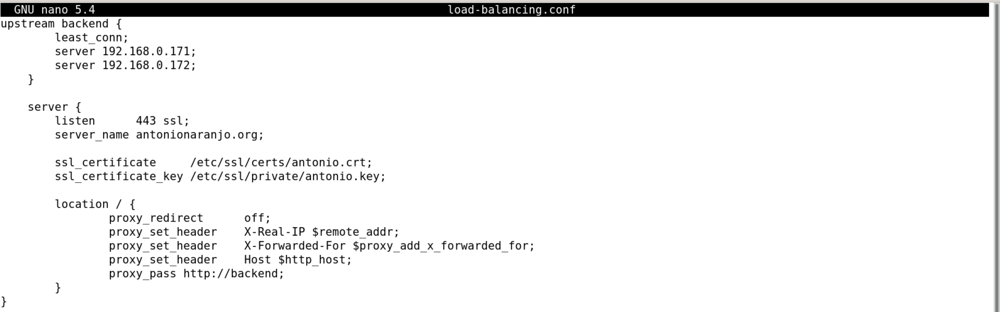

Repetimos la configuracion para servidor 1 y 2.

Para que funcione, el servidor 1 y 2 necesitan el crtificado crt del balanceador de carga.
Lo movemos con scp desde el balanceador de carga:
```
scp /etc/ssl/certs/antonio.crt root@192.168.0.171:/etc/ssl/certs/balanceador.crt
scp /etc/ssl/certs/antonio.crt root@192.168.0.172:/etc/ssl/certs/balanceador.crt
```


# 5.- Referencias.
- [https://es.wikipedia.org/wiki/Nginx](https://es.wikipedia.org/wiki/Nginx)

- [https://marketersgroup.es/diferencias-entre-apache-y-nginx/#:~:text=El%20servidor%20de%20Apache%20tiene,velocidad%20y%20mejora%20el%20rendimiento.](https://marketersgroup.es/diferencias-entre-apache-y-nginx/#:~:text=El%20servidor%20de%20Apache%20tiene,velocidad%20y%20mejora%20el%20rendimiento.)

- [https://www.javatpoint.com/difference-between-apache-and-nginx](https://www.javatpoint.com/difference-between-apache-and-nginx)

- [https://nginx.org/en/docs/http/configuring_https_servers.html](https://nginx.org/en/docs/http/configuring_https_servers.html)

- [https://www.digitalocean.com/community/tutorials/how-to-create-a-self-signed-ssl-certificate-for-nginx-on-centos-7](https://www.digitalocean.com/community/tutorials/how-to-create-a-self-signed-ssl-certificate-for-nginx-on-centos-7)